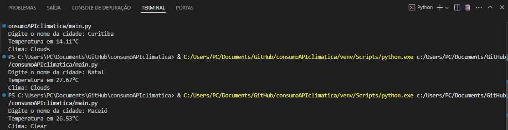

# Consulta de Clima via API 🌥️

Projeto desenvolvido em Python para consultar informações climáticas de qualquer cidade utilizando a API do OpenWeatherMap. O usuário informa o nome da cidade e recebe dados de temperatura atual e condição do clima.

## 📋 Funcionalidades

- Exibição de temperatura de uma cidade em tempo real(em °C)
- Exibição de condição climática (ex: Limpo, Chuva, Nublado)
- Interação via terminal

## 📚 Tecnologias e bibliotecas utilizadas

- Python
- Requests (para requisições HTTP)
- API OpenWeatherMap

