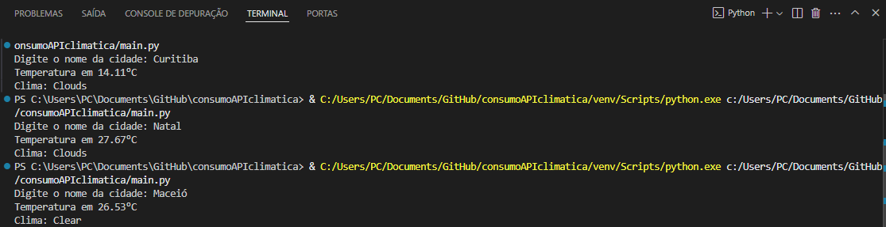

# Consulta de Clima via API 🌥️

Projeto desenvolvido em Python para consultar informações climáticas de qualquer cidade utilizando a API do OpenWeatherMap. O usuário informa o nome da cidade e recebe dados de temperatura atual e condição do clima.

## 📚 Tecnologias e bibliotecas utilizadas

- Python
- Requests (para requisições HTTP)
- API OpenWeatherMap

## 📋 Funcionalidades

- Exibição de temperatura de uma cidade em tempo real(em °C)
- Exibição de condição climática (ex: Limpo, Chuva, Nublado)
- Interação via terminal

## Como executar o projeto

### 1. Clonar o repositório

git clone https://github.com/devAnnaEliza/consumoAPIclimatica-python.git

### 2. Entrar na pasta do projeto

cd **consumoAPIclimatica-python**

### 3. Criar ambiente virtual

python -m venv venv

### 4. Ativar o ambiente virtual

**Windows**
venv\Scripts\activate

**Linux / Mac**
source venv/bin/activate

### 5. Instalar dependências

pip install -r requirements.txt

### 6. Executar o projeto

python src/main.py

